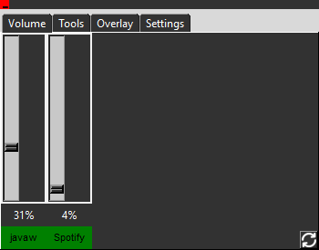
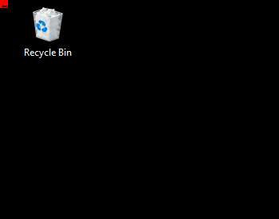
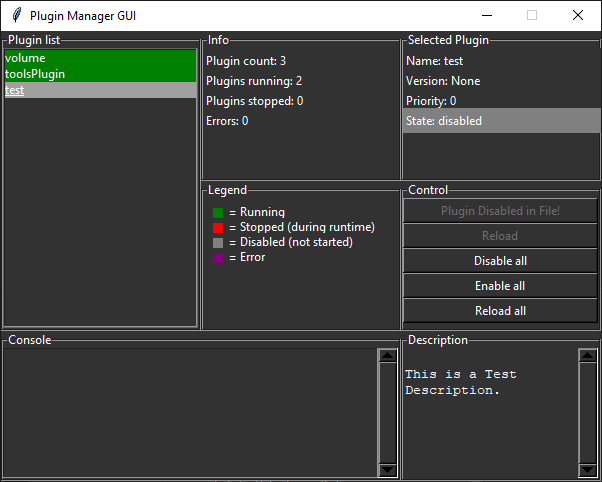

# PyOverlay v1.0

This desktop overlay is highly customizable, with a plugin system. \
Plugin reference see below. 

## Features
* Change application volume.
* Custom tools witch are very small tasks (view example tool).
* add Custom features with plugin system.
* Real "Overlay" like RAM-Usage is unfortunately not finished yet.

## Installation
* Download Repos.
* Move repos to python Lib folder.
* pysettings library is required!  [Download Here](https://github.com/LOL-Hunter/pysettings)
* run ``pip install -r requirements.txt`` to install required packages.
* Run main.py


 


This is the Closed Menu:

 

## Plugin Manager
Manage your plugins, view Errors and reload while coding with integrated Plugin Manager.

 

## Plugin API
Plugins have to be in ```Lib/PyOverlay/src/plugins```. \
All files ends with .py and don't start with "__" get registered as plugins. \
This is a plugin template, introducing all important features from the api.

```python
from PyOverlay.src.plugins import EventHandler, Plugin

DESCRIPTION = """
This is a Test Description.
"""

class TestPlugin(EventHandler):
    def onEnable(self):
        """
        This is the on enable Event!
        Use this as __init__ and initialize your code here.
        """
    def onTabRegisterEvent(self):
        """
        Tab is created with name "Test".
        Widgets can be placed on this tab using the pysettings.tk library.
        """
        self.tab = plugin.registerTab("TEST")
    def onDisable(self, e):
        """
        On Plugin Disable

        @param e:
        @return:
        """
    def onOpen(self):
        """
        Get executed if the menu opens.
        """
    def onClose(self):
        """
        Get executed if the menu closes.
        """
    def onSettingsFrameConstruct(self, frame):
        """
        This method gets executed if the settings are loading.
        Remove this method if your plugin has no settings.
        Widgets can be placed on the frame using the pysettings.tk library.
        """
    def onSettingsCloseEvent(self, e):
        """
        Use this method to save your settings.
        """


plugin = Plugin(priority=0) # priority for event call.
plugin.register(TestPlugin) # register plugin
plugin.disable() # if this method is called the plugin is disabled.
```

## Tool Plugin API
This plugin is used if your task is so tiny that it is not worth it to create a new plugin. \
Add this snippet to ```Lib/PyOverlay/src/plugins/toolsPlugin.py```. \
And modify the ```onSelect``` method.
```python

@register(name="Tool Name Here")
class TestTool(Tool):
    def onSelect(self):
        """
        Code that gets executed if tool gets triggered.
        """
        pass

```
